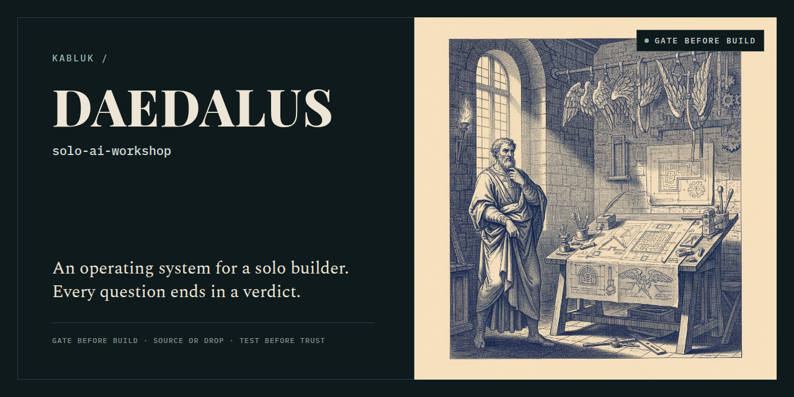
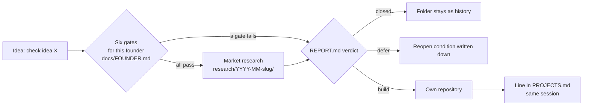

[](https://github.com/kabluk/solo-ai-workshop/actions/workflows/ci.yml)

# solo-ai-workshop



A gate-first operating system for a solo builder working with Claude Code.
One registry of products, one folder per question, and a rule that every piece
of research ends in a verdict: **build**, **defer** or **closed**.

> Use this template → fill in `docs/FOUNDER.md` → start a Claude Code session from this repo → say "check idea X".

The feasibility gates themselves ship separately as the
[`idea-gates`](https://github.com/kabluk/idea-gates) skill. Install it once,
from the root of your copy:

```bash
git clone https://github.com/kabluk/idea-gates .claude/skills/idea-gates
```

Without it the workshop still works: the session-start hook reminds you to
install it, and the agent walks the six gates by hand in the report.

## Why it exists

Before this, my agent sessions started from wherever I happened to be. Drafts landed
in the wrong repos: about 45 orphan branches piled up in one archive. And I once
researched a market for weeks before asking whether I could take its first step at all.
I couldn't. This workshop makes both mistakes structurally hard.

## How an idea flows



## What's inside

```
.
├── CLAUDE.md                     session rules + operating instructions for the agent
├── PROJECTS.md                   product registry (two fictional example rows)
├── docs/
│   ├── FOUNDER.md                blank founder profile; the gates are computed from it
│   ├── REPO-POLICY.md            one project, one repo; private by default; archive, don't delete
│   └── playbook/
│       ├── COLLABORATION.md      numbered cross-project working agreements (P-NN)
│       └── HARVEST.md            ledger of repeats turned into methods
├── research/
│   ├── README.md                 the one-folder-per-question convention
│   ├── _TEMPLATE.md              report template: gates table → findings → verdict
│   └── 2026-01-example-idea/
│       └── REPORT.md             fictional worked example, closed at the gates
├── .claude/
│   ├── settings.json             wires the two hooks
│   ├── hooks/
│   │   ├── session-start.sh      injects the ritual, research index, setup and credential check
│   │   └── stop-cycle.sh         blocks once if a committing cycle skips harvest, the
│   │                             three next-step options, or a report verdict
│   └── skills/
│       ├── harvest/              turn every repeat into a skill, rule or gotcha
│       ├── external-review/      fact-loaded prompt for other LLMs + claim verification
│       └── writing-for-agents/   how to write skills and CLAUDE.md files
├── scripts/
│   └── check-reports.sh          every research/*/REPORT.md must end with a verdict
└── .github/workflows/ci.yml      bash -n, settings.json validity, verdict check, hook smoke run
```

`idea-gates` lands in `.claude/skills/idea-gates/` once you install it.

## The six rules

1. **Results land in a file.** Research that leaves no `REPORT.md` didn't happen.
2. **One question, one folder.** No dumping into the root, no branch per thought.
3. **A verdict is mandatory.** "Interesting, unclear" is not a verdict.
4. **Numbers carry a source**, or are labelled as an estimate.
5. **A matured idea gets its own repo**, and a line in `PROJECTS.md` in the same session.
6. **Gates before the ocean.** Feasibility for *this* founder first, market analysis second.

## How I built this with AI agents

The rules are the agents' rules: Claude Code reads `CLAUDE.md` at session start,
hooks inject the ritual, and the `harvest` skill turns every repeated mistake into
a new rule or skill. The workshop rewrites itself as it is used.

## License

MIT
